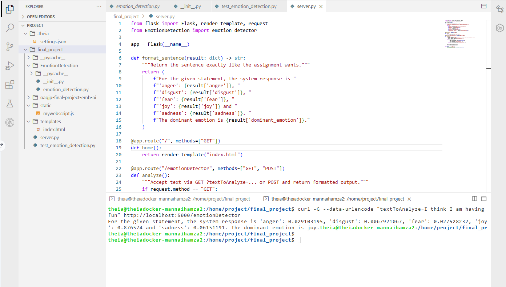

This project is licensed under the terms of the MIT license.

# Emotion Detection – Flask + Watson NLP (Final Project)



This repository contains a small web application and Python package that call the **Watson NLP EmotionPredict** endpoint to classify text into five emotions and report the **dominant_emotion**.  
It includes a packaged module, unit tests, a Flask UI, blank-input error handling, and static code analysis (Pylint score: **10/10**).

Feedback and suggestions are welcome—happy coding! 🎉

---

## PROJECT NOTES

**Version:** 1.0  
**Version Date:** 2025-10-14  
**Author:** *hamzamann9962*  
**Course:** IBM Embeddable AI – Emotion Detection Final Project

---

## Tech Stack / Libraries

- Python 3
- Flask (web server)
- Requests (HTTP client)
- Pylint (static code analysis)
- Watson NLP (hosted in Skills Network) – **EmotionPredict** endpoint  
  - URL: `https://sn-watson-emotion.labs.skills.network/v1/watson.runtime.nlp.v1/NlpService/EmotionPredict`  
  - Header: `grpc-metadata-mm-model-id: emotion_aggregated-workflow_lang_en_stock`  
  - Body: `{ "raw_document": { "text": "<your text here>" } }`

---

## Folder Structure

final_project/
├─ EmotionDetection/
│ ├─ init.py
│ └─ emotion_detection.py
├─ static/
│ └─ mywebscript.js
├─ templates/
│ └─ index.html
├─ server.py
├─ test_emotion_detection.py
└─ pictures/
├─ 1_folder_structure.png
├─ 2a_emotion_detection.png
├─ 2b_application_creation.png
├─ 3a_output_formatting.png
├─ 3b_formatted_output_test.png
├─ 4a_packaging.png
├─ 4b_packaging_test.png
├─ 5a_unit_testing.png
├─ 5b_unit_testing_result.png
├─ 6a_server.png
├─ 6b_deployment_test.png
├─ 7a_error_handling_function.png
├─ 7b_error_handling_server.png
├─ 7c_error_handling_interface.png
├─ 8a_server_modified.png
└─ 8b_static_code_analysis.png


---

## Quick Start

### 1) Install deps (optionally in a venv)
```bash
python3 -m venv .venv
# Linux/Mac
source .venv/bin/activate
# Windows PowerShell
# .venv\Scripts\Activate.ps1

python3 -m pip install flask requests pylint

2) Run the app
python3 server.py
# App runs at http://127.0.0.1:5000

3) Try the endpoint
# GET with query param
curl -G --data-urlencode "textToAnalyze=I think I am having fun" http://localhost:5000/emotionDetector


You’ll receive:

For the given statement, the system response is 'anger': <...>, 'disgust': <...>, 'fear': <...>, 'joy': <...> and 'sadness': <...>. The dominant emotion is <joy|...>.

Using the Package Directly
from EmotionDetection import emotion_detector

print(emotion_detector("I am so happy I am doing this"))
# {'anger': 0.xx, 'disgust': 0.xx, 'fear': 0.xx, 'joy': 0.xx, 'sadness': 0.xx, 'dominant_emotion': 'joy'}

Unit Tests
python3 test_emotion_detection.py
# 5 tests cover joy, anger, disgust, sadness, fear
